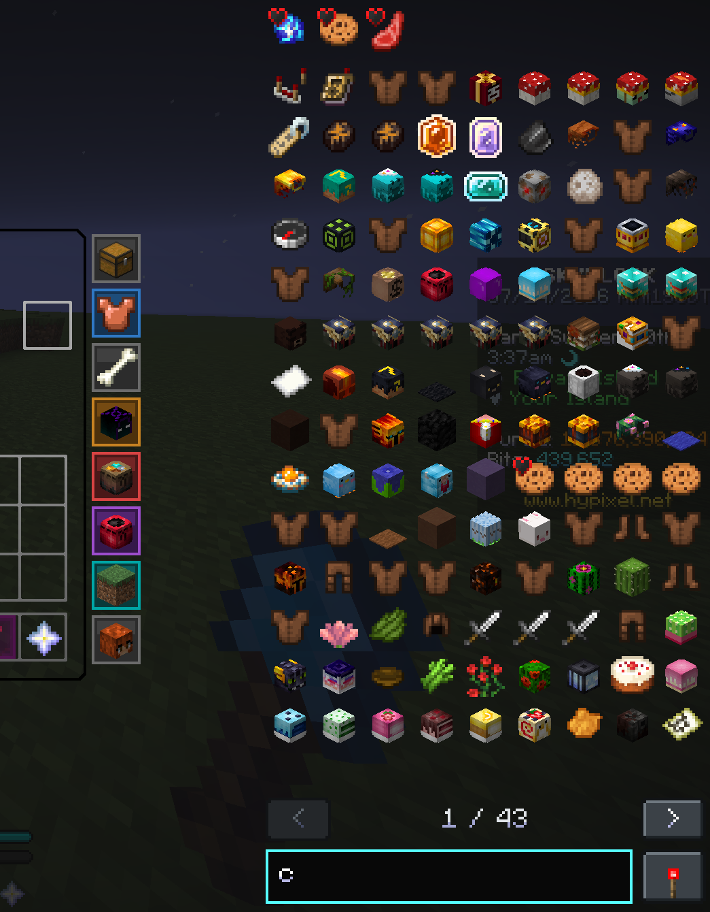
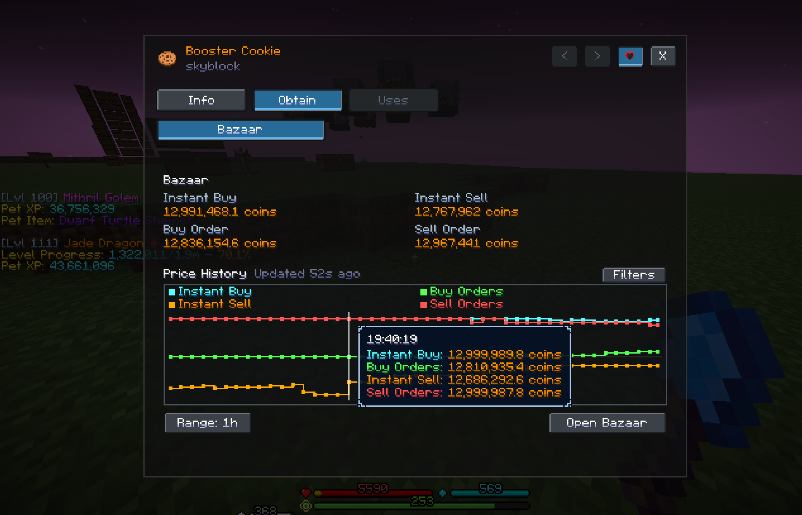
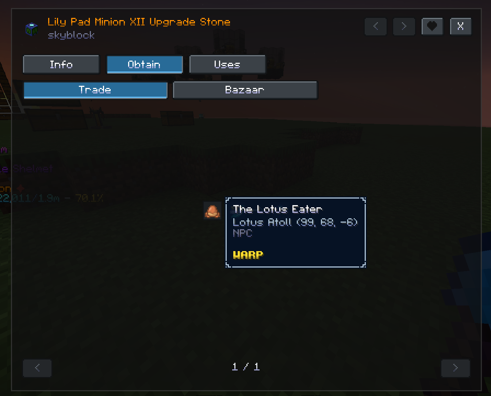

<div align="center">

# Skysoft

A modern Fabric mod with quality-of-life features for Hypixel SkyBlock.

[](https://modrinth.com/mod/skysoft)
[](https://discord.gg/akin)
[](LICENSE)

</div>

Skysoft improves everyday SkyBlock gameplay with inventory tools, market tracking, interface customization, and other focused utilities. It draws inspiration from projects such as [SkyHanni](https://modrinth.com/mod/skyhanni) and [Firmament](https://modrinth.com/mod/firmament).

## Main Features

### Item List

Browse SkyBlock items, recipes, usages, obtain sources, and market data directly from inventory screens. Search the catalog, explore Crafting, Forge, and Kat recipes, inspect Bazaar history and order depth, and create waypoints to relevant NPCs.

<p align="center">
  
  
</p>
<p align="center">
  
</p>

### Bazaar Tracker

Follow Bazaar order progress in real time without repeatedly opening the Bazaar. Filling estimates approximate how much of each order has completed, while Flipping Mode tracks total or per-session profit.


### Inventory Buttons

Create fully customizable buttons for quick access to your favorite menus and commands.

<p align="center">
  
  
  
</p>

### Storage Overlay

Browse and manage all of your SkyBlock storage pages from one interface.


## More Features

<details>
<summary>Preserve Cursor Position</summary>

Keeps the mouse in place while moving between SkyBlock inventories and menus.


</details>

<details>
<summary>Customizable Full Inventory Warning</summary>

Warns when your inventory reaches a configurable fullness threshold.


</details>

<details>
<summary>Slot Binding</summary>

Binds two inventory slots so their held items can be swapped with a shift-click.


</details>

<details>
<summary>Auto-Sprint</summary>

Automatically keeps the player sprinting without holding a key.


</details>

<details>
<summary>Action Bar Background</summary>

Draws a configurable background behind the action bar.


</details>

<details>
<summary>Lotum Helper</summary>

Draws a line to clicked Lotums.


</details>

<details>
<summary>Separate Inventory and Tooltip GUI Scale</summary>

Uses independent sizes for inventories and tooltips without changing the rest of the GUI.


</details>

<details>
<summary>Smooth Chat</summary>

Animates new messages and the chat screen opening.


</details>

## Installation

Skysoft supports Minecraft 26.1 and 26.2 and requires [Java 25](https://adoptium.net/temurin/releases/?version=25).

1. Install [Fabric Loader](https://fabricmc.net/use/installer/) for a supported Minecraft version.
2. Install [Fabric API](https://modrinth.com/mod/fabric-api), [Fabric Language Kotlin](https://modrinth.com/mod/fabric-language-kotlin), and the [Hypixel Mod API](https://modrinth.com/mod/hypixel-mod-api).
3. Download Skysoft from [Modrinth](https://modrinth.com/mod/skysoft).
4. Place the mods in your Minecraft `mods` folder and launch the game.

Use `/ss` or `/skysoft` to open the configuration screen. [Mod Menu](https://modrinth.com/mod/modmenu) is supported but optional.

## Support and Bug Reports

Support and bug reports are handled in the [official Discord server](https://discord.gg/akin).

## Building

Build every supported Minecraft version and run all checks:

```powershell
.\gradlew.bat build
```

```bash
./gradlew build
```

The distributable jars are written to `build/libs`.

See [CONTRIBUTING.md](CONTRIBUTING.md) before opening a pull request.

## License

Except for specifically marked files, Skysoft's original code is licensed under the [GNU Lesser General Public License v3.0 only](LICENSE), with its incorporated [GNU General Public License v3.0 terms](LICENSE-GPL-3.0). Files adapted from SkyHanni contain an `SPDX-License-Identifier: LGPL-2.1-only` notice and remain under the [GNU Lesser General Public License v2.1 only](LICENSE-LGPL-2.1). Exact file paths and attribution are listed in [credits.md](credits.md).

Third-party software retains its own license terms; see [THIRD_PARTY_NOTICES.md](THIRD_PARTY_NOTICES.md).

Skysoft is not an official Minecraft service and is not approved by or associated with Mojang, Microsoft, or Hypixel.
